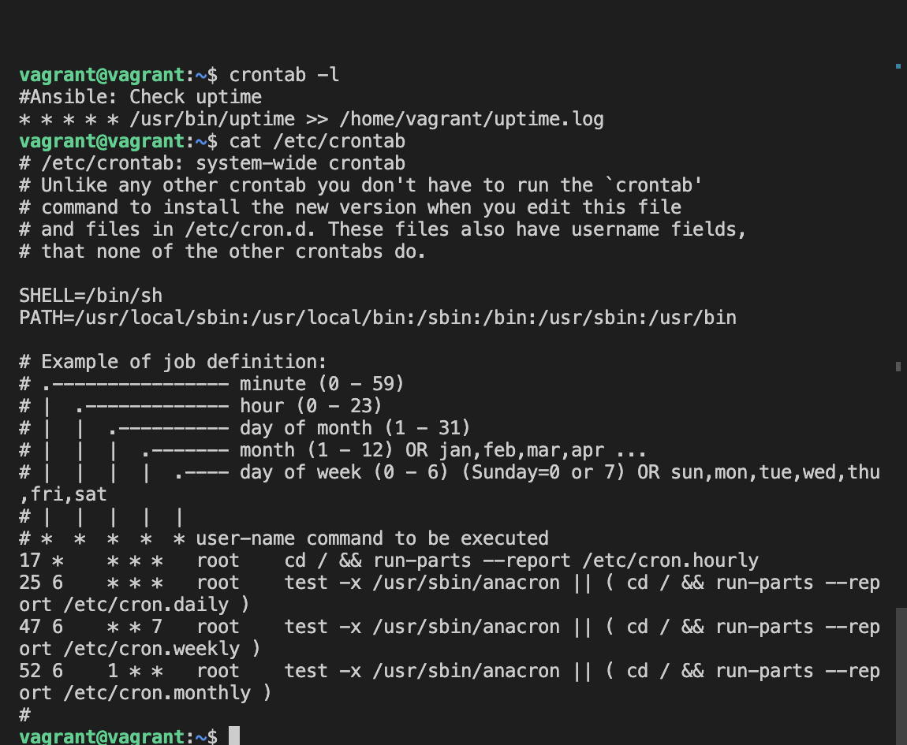

# Vagrant Multi-VM Setup for Laravel with LAMP Stack

This Vagrant configuration sets up a multi-VM environment with a master and slave configuration. The master node is provisioned with a LAMP stack and Laravel, while the slave node runs Ansible to automate tasks for the master.

## Prerequisites

- [Vagrant](https://www.vagrantup.com/downloads.html)
- [VirtualBox](https://www.virtualbox.org/wiki/Downloads) or [VMware](https://www.vmware.com/products/workstation-pro/workstation-pro-evaluation.html)
- A terminal or command prompt to execute commands

## Configuration

- Master Node:
  - IP Address: `192.168.56.7`
  - RAM: `2048MB`
  - CPU Cores: `2`
  - Creates bash script for LAMB stack provisioning and laravel app configuration
  - Serves Laravel Application

- Slave Node:
  - IP Address: `192.168.56.17`
  - RAM: `2048MB`
  - CPU Cores: `1`
  - Runs Ansible to provision and execute the bash script created in the Master node

## Setup Instructions

1. **Clone the Repository**:

   ```bash
   git clone https://github.com/felixokpalaima/altschool-second-semester-cloud-exam.git
   cd altschool-second-semester-cloud-exam
   ```

2. **Start and Provision VMs**:

   ```bash
   chmod +x script.sh
   ./script.sh up
   ```

   This will start both VMs and execute the provisioning scripts.

3. **Access the Laravel application**
    To accept the laravel application, copy and paste the master VM's ip address on th browser.

    

4. **SSH into VMs (if needed)**:

   To access the master:

   ```bash
   vagrant ssh master
   ```

   To access the slave:

   ```bash
   vagrant ssh slave
   ```

5. **Halt VMs (when done)**:

   To halt both VMs:

   ```bash
   vagrant halt
   ```
6. **Destroy VMs (when no longer needed)**:

   To halt both VMs:

   ```bash
   vagrant destroy
   ```

## Additional Information

- The Master node gets a fresh installation of Laravel and a LAMP stack.
- Ansible on the Slave node will ensure the Master node's LAMP stack is set up correctly and will also set up the Apache2 configuration for Laravel.
- A cron job is configured to check the server's uptime every midnight and logs it in `/home/vagrant/uptime.log`.



## Contribution

Pull requests are welcome. For major changes, please open an issue first to discuss what you would like to change.
